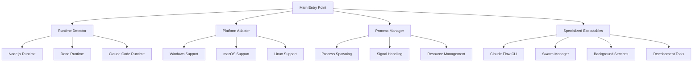

[根目录](../CLAUDE.md) > **bin**

# 可执行文件模块 (bin/)

## 模块职责

可执行文件模块是 Claude Flow 的入口点和运行时系统，提供了跨平台的启动脚本、专用的可执行文件和系统服务。该模块负责运行时检测、环境配置、进程管理和多模式运行支持。

## 架构概览



## 主要组件

### 核心可执行文件
- **claude-flow.js** - 主启动脚本，支持运行时自动检测和跨平台兼容
- **claude-flow** - Unix/Linux 可执行文件
- **claude-flow.bat** - Windows 批处理文件
- **claude-flow.ps1** - Windows PowerShell 脚本

### 专用执行器
- **claude-flow-dev** - 开发模式启动器
- **claude-flow-pkg.js** - 打包版本启动器
- **claude-flow-swarm** - 群体模式启动器
- **claude-flow-swarm-background** - 后台群体服务
- **claude-flow-swarm-monitor** - 群体监控工具
- **claude-flow-swarm-ui** - 群体用户界面

### 功能模块
- **agent.js** - 代理管理命令行工具
- **memory.js** - 内存管理工具
- **task.js** - 任务管理工具
- **swarm.js** - 群体管理工具
- **config.js** - 配置管理工具
- **hooks.js** - Hook 系统工具
- **github.js** - GitHub 集成工具
- **automation.js** - 自动化工具

### 开发和调试工具
- **analysis.js** - 系统分析工具
- **coordination.js** - 协调分析工具
- **monitor.js** - 监控工具
- **init.js** - 初始化工具
- **automation-executor.js** - 自动化执行器
- **batch-manager.js** - 批量管理器

## 核心功能

### 运行时检测和适配
```javascript
// 主启动脚本逻辑
async function main() {
  try {
    // 1. 检测可用的运行时环境
    const runtime = await detectBestRuntime();

    // 2. 选择合适的执行文件
    const executable = selectExecutable(runtime);

    // 3. 配置环境变量和参数
    const env = configureEnvironment();

    // 4. 启动主程序
    await spawnProcess(executable, args, env);

  } catch (error) {
    handleError(error);
  }
}

function detectBestRuntime() {
  // 优先级：Node.js > Deno > Claude Code
  if (isNodeAvailable()) return 'node';
  if (isDenoAvailable()) return 'deno';
  if (isClaudeCodeAvailable()) return 'claude';
  throw new Error('No compatible runtime found');
}
```

### 跨平台兼容性
```bash
# Windows
claude-flow.bat          # 批处理启动器
claude-flow.ps1          # PowerShell 启动器

# Unix/Linux/macOS
claude-flow              # Shell 脚本启动器
#!/usr/bin/env node      # Node.js shebang
#!/usr/bin/env deno      # Deno shebang

# 跨平台配置
config/windows.json
config/macos.json
config/linux.json
```

### 进程管理
```javascript
// 进程管理器功能
class ProcessManager {
  constructor() {
    this.processes = new Map();
    this.monitors = new Map();
  }

  // 启动子进程
  async startProcess(name, command, args, options) {
    const process = spawn(command, args, {
      stdio: ['pipe', 'pipe', 'pipe'],
      detached: false,
      ...options
    });

    // 设置进程监控
    this.setupMonitoring(name, process);

    // 处理进程事件
    process.on('exit', (code) => this.handleExit(name, code));
    process.on('error', (error) => this.handleError(name, error));

    this.processes.set(name, process);
    return process;
  }

  // 优雅关闭
  async gracefulShutdown() {
    const shutdownPromises = Array.from(this.processes.entries()).map(
      ([name, process]) => this.stopProcess(name, 'shutdown')
    );
    await Promise.all(shutdownPromises);
  }
}
```

### 专用执行模式

#### 开发模式
```bash
# 开发模式启动
./bin/claude-flow-dev

# 特性：
- 热重载支持
- 详细日志输出
- 调试模式启用
- 源码映射启用
- 开发工具集成
```

#### 群体模式
```bash
# 群体模式启动
./bin/claude-flow-swarm

# 特性：
- 多代理协调
- 分布式执行
- 负载均衡
- 故障恢复
- 实时监控
```

#### 后台服务模式
```bash
# 后台服务启动
./bin/claude-flow-swarm-background

# 特性：
- 后台运行
- 系统服务集成
- 日志轮转
- 自动重启
- 性能监控
```

## 开发规范

### 可执行文件结构
```javascript
#!/usr/bin/env node

/**
 * Claude Flow - [功能描述]
 * 版本: [版本号]
 * 作者: [作者信息]
 */

import { fileURLToPath } from 'url';
import { dirname, resolve } from 'path';

const __filename = fileURLToPath(import.meta.url);
const __dirname = dirname(__filename);

// 版本信息
const VERSION = '2.7.34';

// 主函数
async function main() {
  try {
    // 参数解析
    const args = parseArguments(process.argv.slice(2));

    // 配置加载
    const config = await loadConfig(args.config);

    // 核心逻辑
    await executeCommand(args, config);

  } catch (error) {
    handleError(error);
    process.exit(1);
  }
}

// 启动主函数
main();
```

### 错误处理规范
```javascript
// 统一错误处理
function handleError(error) {
  console.error(`❌ Error: ${error.message}`);

  if (process.env.DEBUG) {
    console.error(error.stack);
  }

  // 错误分类处理
  switch (error.code) {
    case 'ENOENT':
      console.error('File or directory not found');
      break;
    case 'EACCES':
      console.error('Permission denied');
      break;
    case 'EADDRINUSE':
      console.error('Port already in use');
      break;
    default:
      console.error('Unknown error occurred');
  }
}

// 优雅退出
function setupGracefulShutdown() {
  const cleanup = () => {
    console.log('\n🧹 Cleaning up...');
    // 清理资源
    process.exit(0);
  };

  process.on('SIGINT', cleanup);
  process.on('SIGTERM', cleanup);
  process.on('SIGQUIT', cleanup);
}
```

### 信号处理
```javascript
// 进程信号处理
function setupSignalHandlers() {
  // SIGINT (Ctrl+C)
  process.on('SIGINT', () => {
    console.log('\n📡 Received SIGINT signal');
    gracefulShutdown();
  });

  // SIGTERM (termination)
  process.on('SIGTERM', () => {
    console.log('📡 Received SIGTERM signal');
    gracefulShutdown();
  });

  // uncaughtException
  process.on('uncaughtException', (error) => {
    console.error('💥 Uncaught Exception:', error);
    gracefulShutdown();
  });

  // unhandledRejection
  process.on('unhandledRejection', (reason, promise) => {
    console.error('💥 Unhandled Rejection at:', promise, 'reason:', reason);
    gracefulShutdown();
  });
}
```

## 测试指南

### 单元测试
- 测试参数解析逻辑
- 测试配置加载机制
- 测试错误处理
- 测试工具函数

### 集成测试
- 测试完整启动流程
- 测试跨平台兼容性
- 测试进程管理
- 测试信号处理

### 系统测试
- 测试不同操作系统上的行为
- 测试不同 Node.js 版本的兼容性
- 测试资源使用情况
- 测试并发启动场景

### 性能测试
- 测试启动时间
- 测试内存使用
- 测试 CPU 使用
- 测试文件 I/O 性能

## 与其他模块的集成

### CLI 模块
- 可执行文件作为 CLI 命令的入口点
- 支持所有 CLI 功能的命令行调用
- 提供脚本化和自动化支持

### 代理系统模块
- 代理进程的启动和管理
- 代理运行时环境的配置
- 代理进程的监控和调试

### API 服务模块
- API 服务器的启动脚本
- 开发和生产模式的切换
- 服务进程的管理

### 内存管理模块
- 内存服务的启动和管理
- 数据库连接的初始化
- 存储后端的配置

## 配置和脚本

### 环境配置
```bash
# 运行时环境
NODE_ENV=development          # 环境模式
DEBUG=*                      # 调试模式
LOG_LEVEL=info               # 日志级别

# 路径配置
CLAUDE_FLOW_ROOT=/path/to/claude-flow
CLAUDE_FLOW_CONFIG=/path/to/config
CLAUDE_FLOW_DATA=/path/to/data

# 性能配置
UV_THREADPOOL_SIZE=16        # 线程池大小
NODE_OPTIONS=--max-old-space-size=4096
```

### 启动脚本模板
```bash
#!/bin/bash
# Claude Flow 启动脚本

set -e  # 遇到错误时退出

# 配置变量
SCRIPT_DIR="$(cd "$(dirname "${BASH_SOURCE[0]}")" && pwd)"
PROJECT_ROOT="$(dirname "$SCRIPT_DIR")"
NODE_ENV="${NODE_ENV:-production}"

# 颜色输出
RED='\033[0;31m'
GREEN='\033[0;32m'
YELLOW='\033[1;33m'
NC='\033[0m' # No Color

# 日志函数
log_info() {
    echo -e "${GREEN}[INFO]${NC} $1"
}

log_error() {
    echo -e "${RED}[ERROR]${NC} $1"
}

log_warn() {
    echo -e "${YELLOW}[WARN]${NC} $1"
}

# 主逻辑
main() {
    log_info "Starting Claude Flow..."

    # 环境检查
    check_environment

    # 启动应用
    start_application

    log_info "Claude Flow started successfully!"
}

# 执行主函数
main "$@"
```

### 打包配置
```json
{
  "pkg": {
    "targets": [
      "node20-linux-x64",
      "node20-macos-x64",
      "node20-win-x64"
    ],
    "scripts": "dist/**/*.js",
    "outputPath": "bin",
    "options": [
      "--experimental-specifier-resolution=node"
    ]
  }
}
```

## 常见问题 (FAQ)

### Q: 如何添加新的可执行文件？
A: 在 `bin/` 目录下创建新的脚本文件，并设置适当的执行权限。

### Q: 如何处理不同平台的差异？
A: 使用平台检测代码和条件逻辑，为不同平台提供特定的实现。

### Q: 如何实现优雅的进程关闭？
A: 监听系统信号，实现清理逻辑，确保资源正确释放。

### Q: 如何调试启动问题？
A: 使用 `DEBUG=*` 环境变量启用详细日志，检查错误消息和堆栈跟踪。

## 相关文件清单

### 核心可执行文件
- `claude-flow.js` - 主启动脚本
- `claude-flow` - Unix/Linux 可执行文件
- `claude-flow.bat` - Windows 批处理文件
- `claude-flow.ps1` - Windows PowerShell 脚本

### 专用执行器
- `claude-flow-dev` - 开发模式启动器
- `claude-flow-swarm*` - 群体模式相关文件
- `claude-flow-pkg.js` - 打包版本启动器

### 功能模块
- `agent.js` - 代理管理工具
- `memory.js` - 内存管理工具
- `task.js` - 任务管理工具
- `swarm.js` - 群体管理工具
- `config.js` - 配置管理工具

### 开发工具
- `analysis.js` - 系统分析工具
- `coordination.js` - 协调分析工具
- `monitor.js` - 监控工具
- `init.js` - 初始化工具

### 测试文件
- `__tests__/agent.test.js`
- `__tests__/memory.test.js`
- `__tests__/swarm.test.js`
- `__tests__/task.test.js`

## 变更记录 (Changelog)

### v2.7.0
- 改进了运行时检测机制
- 添加了更多专用执行器
- 优化了跨平台兼容性
- 增强了进程管理功能

### v2.6.0
- 重构了启动脚本架构
- 添加了优雅退出机制
- 改进了错误处理

### v2.5.0
- 初始可执行文件架构
- 实现了基础启动脚本
- 添加了平台检测功能