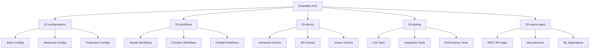

[根目录](../CLAUDE.md) > **examples**

# 示例代码模块 (examples/)

## 模块职责

示例代码模块是 Claude Flow 的学习和参考中心，提供了丰富的配置模板、工作流示例、演示脚本和测试用例。该模块旨在帮助用户快速上手、理解最佳实践，并提供了从基础使用到高级场景的完整示例集合。

## 架构概览



## 主要组件

### 配置示例 (01-configurations/)
- **basic/** - 基础配置模板
  - `simple-config.json` - 最简单的配置
  - `minimal-config.json` - 最小化配置
- **development/** - 开发环境配置
  - `development-config.json` - 开发模式配置
- **advanced/** - 高级配置
  - `production-config.json` - 生产环境配置
- **specialized/** - 专用配置
  - `research-config.json` - 研究专用配置
  - `testing-config.json` - 测试专用配置

### 工作流示例 (02-workflows/)
- **simple/** - 简单工作流
  - `hello-world-workflow.json` - Hello World 示例
- **sequential/** - 顺序工作流
  - `blog-platform-workflow.json` - 博客平台开发流程
- **parallel/** - 并行工作流
  - `data-processing-workflow.json` - 数据处理并行流程
- **complex/** - 复杂工作流
  - `microservices-workflow.json` - 微服务架构工作流
- **specialized/** - 专用工作流
  - `research-workflow.json` - 研究工作流
  - `machine-learning-workflow.json` - 机器学习工作流
- **claude-workflow.json** - Claude 专用工作流示例

### 演示脚本 (03-demos/)
- **quick/** - 快速演示
  - `quick-api-demo.sh` - 快速 API 演示
- **interactive/** - 交互式演示
  - `chat-bot-demo.sh` - 聊天机器人演示
- **rest-api-demo.sh** - REST API 演示
- **swarm/** - 群体演示
  - `multi-agent-demo.sh` - 多代理协作演示
  - `swarm-showcase.sh` - 群体功能展示
- `demo-swarm-app.sh` - 群体应用演示
- `create-swarm-sample.sh` - 创建群体样本

### 测试用例 (04-testing/)
- **integration/** - 集成测试
  - `test-workflow-execution.sh` - 工作流执行测试
- **performance/** - 性能测试
  - `benchmark-swarm.sh` - 群体性能基准测试
- **unit/** - 单元测试
  - `test-memory-system.sh` - 内存系统测试
- **test-swarm-cli.sh** - CLI 群体测试
- **test-incremental-demo.js** - 增量更新演示测试
- **test-incremental-updates.js` - 增量更新测试
- `sparc-swarm-test.sh` - SPARC 群体测试

### 群体应用 (05-swarm-apps/)
- **rest-api/** - REST API 应用
  - 完整的 RESTful API 示例应用
  - 包含认证、路由、数据模型等
- **rest-api-advanced/** - 高级 REST API 应用
  - 企业级 API 应用示例
  - 包含 Docker、CI/CD、监控等
- **microservices/** - 微服务应用示例
- **ml-apps/** - 机器学习应用示例

## 核心示例详解

### 基础配置示例
```json
{
  "name": "claude-flow-basic",
  "version": "1.0.0",
  "description": "基础 Claude Flow 配置",

  "agents": {
    "maxAgents": 10,
    "defaultType": "researcher",
    "autoRestart": true
  },

  "memory": {
    "backend": "sqlite",
    "path": "./data/memory.sqlite",
    "cacheSize": 1000
  },

  "cli": {
    "outputFormat": "pretty",
    "colorOutput": true,
    "autoComplete": true
  },

  "api": {
    "enabled": false,
    "port": 3000,
    "cors": {
      "origins": ["http://localhost:3000"]
    }
  }
}
```

### 研究工作流示例
```json
{
  "name": "research-workflow",
  "description": "学术研究工作流",
  "version": "1.0.0",

  "stages": [
    {
      "name": "literature-review",
      "description": "文献综述",
      "agent": "researcher",
      "tasks": [
        "搜索相关文献",
        "分析现有研究",
        "识别研究空白"
      ],
      "outputs": ["literature-review.md"]
    },
    {
      "name": "methodology-design",
      "description": "方法论设计",
      "agent": "architect",
      "tasks": [
        "设计研究框架",
        "制定实验方案",
        "选择研究方法"
      ],
      "outputs": ["methodology.md"]
    },
    {
      "name": "implementation",
      "description": "实现阶段",
      "agent": "developer",
      "tasks": [
        "开发原型系统",
        "实现算法",
        "编写测试"
      ],
      "outputs": ["prototype/", "tests/"]
    }
  ],

  "parallelStages": [
    {
      "name": "testing",
      "description": "并行测试",
      "agents": ["tester", "analyst"],
      "tasks": [
        "功能测试",
        "性能分析",
        "安全测试"
      ]
    }
  ]
}
```

### 群体应用示例
```bash
#!/bin/bash
# 多代理协作演示脚本

echo "🚀 启动 Claude Flow 多代理协作演示"

# 1. 初始化群体
echo "📝 创建研究群体..."
claude-flow swarm init --name "research-team" --topology "mesh"

# 2. 生成专业代理
echo "🤖 生成专业代理..."
claude-flow agent spawn researcher --name "AI研究员" --team "research-team"
claude-flow agent spawn developer --name "全栈开发者" --team "research-team"
claude-flow agent spawn tester --name "质量工程师" --team "research-team"

# 3. 创建研究任务
echo "📋 创建研究任务..."
claude-flow task create "开发智能推荐系统" \
  --priority high \
  --assign "research-team" \
  --workflow "research-workflow.json"

# 4. 启动协作
echo "🔄 启动协作模式..."
claude-flow swarm start --name "research-team" --monitor

echo "✅ 演示完成！查看群体状态："
claude-flow swarm status --name "research-team"
```

### REST API 应用示例
```javascript
// rest-api/src/app.js
const express = require('express');
const { ClaudeFlow } = require('claude-flow');

const app = express();
const claudeFlow = new ClaudeFlow({
  configPath: './claude-flow.config.json'
});

// 中间件
app.use(express.json());
app.use('/api/health', require('./routes/health'));

// API 路由
app.use('/api/users', require('./routes/users'));
app.use('/api/products', require('./routes/products'));

// Claude Flow 集成路由
app.post('/api/claude/analyze', async (req, res) => {
  try {
    const { text, analysisType } = req.body;

    // 启动分析代理
    const analyst = await claudeFlow.spawnAgent('analyst');
    const result = await analyst.analyze(text, analysisType);

    res.json({ success: true, result });
  } catch (error) {
    res.status(500).json({ error: error.message });
  }
});

// 启动服务器
const PORT = process.env.PORT || 3000;
app.listen(PORT, () => {
  console.log(`🚀 Server running on port ${PORT}`);

  // 初始化 Claude Flow
  claudeFlow.initialize().then(() => {
    console.log('✅ Claude Flow initialized');
  });
});
```

## 使用指南

### 快速开始
```bash
# 1. 复制基础配置
cp examples/01-configurations/basic/simple-config.json ./claude-flow.config.json

# 2. 运行快速演示
bash examples/03-demos/quick/quick-api-demo.sh

# 3. 创建第一个群体
bash examples/03-demos/create-swarm-sample.sh

# 4. 运行交互式演示
bash examples/03-demos/interactive/chat-bot-demo.sh
```

### 高级场景
```bash
# 运行完整工作流
claude-flow workflow execute examples/02-workflows/complex/microservices-workflow.json

# 启动高级群体应用
cd examples/05-swarm-apps/rest-api-advanced
npm install
npm start

# 运行性能测试
bash examples/04-testing/performance/benchmark-swarm.sh

# 测试增量更新
node examples/04-testing/test-incremental-updates.js
```

### 开发模式
```bash
# 启动开发环境
CLAUDE_FLOW_ENV=development claude-flow dev

# 使用调试配置
claude-flow --config examples/01-configurations/development/development-config.json

# 启用详细日志
DEBUG=* claude-flow swarm start --name debug-team
```

## 开发规范

### 示例结构规范
```
examples/
├── 01-configurations/          # 配置示例
│   ├── basic/                 # 基础配置
│   ├── development/           # 开发配置
│   ├── advanced/              # 高级配置
│   └── specialized/           # 专用配置
├── 02-workflows/              # 工作流示例
│   ├── simple/                # 简单工作流
│   ├── sequential/            # 顺序工作流
│   ├── parallel/              # 并行工作流
│   └── complex/               # 复杂工作流
├── 03-demos/                  # 演示脚本
│   ├── quick/                 # 快速演示
│   ├── interactive/           # 交互演示
│   └── swarm/                 # 群体演示
├── 04-testing/                # 测试用例
│   ├── unit/                  # 单元测试
│   ├── integration/           # 集成测试
│   └── performance/           # 性能测试
└── 05-swarm-apps/             # 群体应用
    ├── rest-api/              # REST API
    ├── microservices/         # 微服务
    └── ml-apps/               # ML 应用
```

### 示例质量标准
1. **完整性** - 包含完整的运行所需文件
2. **可执行性** - 能够直接运行并产生预期结果
3. **文档化** - 提供详细的 README 和注释
4. **最佳实践** - 遵循项目最佳实践
5. **渐进性** - 从简单到复杂的递进式学习

## 测试和验证

### 自动化测试
```bash
# 运行所有示例测试
npm run test:examples

# 测试特定示例
npm run test:example -- --name rest-api-advanced

# 验证示例完整性
npm run validate:examples
```

### 示例验证检查清单
- [ ] 配置文件格式正确
- [ ] 脚本可执行权限设置
- [ ] 依赖项完整列出
- [ ] 文档准确无误
- [ ] 示例能够正常运行
- [ ] 输出结果符合预期

## 贡献指南

### 添加新示例
1. 确定合适的分类目录
2. 遵循目录命名规范
3. 包含完整的文件集
4. 编写详细的 README
5. 添加相应的测试用例
6. 更新主文档索引

### 示例提交标准
```markdown
## 示例名称
- **类别**: 配置/工作流/演示/测试/应用
- **难度**: 初级/中级/高级
- **预计时间**: 完成所需时间
- **前置要求**: 需要的知识和工具
- **学习目标**: 通过示例学习的技能

## 文件结构
```
example-name/
├── README.md              # 详细说明文档
├── config.json           # 配置文件
├── script.sh             # 执行脚本
├── assets/               # 资源文件
└── output/               # 预期输出
```
```

## 常见问题 (FAQ)

### Q: 如何选择适合的示例？
A: 根据你的经验水平，从基础配置开始，逐步尝试更复杂的示例。

### Q: 示例运行失败怎么办？
A: 检查环境配置、依赖项和版本兼容性，参考故障排除指南。

### Q: 如何修改示例用于自己的项目？
A: 复制示例目录，根据需要修改配置和参数，保留原有结构。

### Q: 如何贡献新的示例？
A: 遵循贡献指南，确保示例质量和文档完整性。

## 相关文件清单

### 配置示例
- `01-configurations/basic/simple-config.json`
- `01-configurations/advanced/production-config.json`
- `01-configurations/specialized/research-config.json`

### 工作流示例
- `02-workflows/simple/hello-world-workflow.json`
- `02-workflows/complex/microservices-workflow.json`
- `02-workflows/specialized/research-workflow.json`

### 演示脚本
- `03-demos/quick/quick-api-demo.sh`
- `03-demos/swarm/multi-agent-demo.sh`
- `03-demos/interactive/chat-bot-demo.sh`

### 测试用例
- `04-testing/integration/test-workflow-execution.sh`
- `04-testing/performance/benchmark-swarm.sh`
- `04-testing/test-incremental-updates.js`

### 群体应用
- `05-swarm-apps/rest-api/`
- `05-swarm-apps/rest-api-advanced/`

### 文档文件
- `01-configurations/README.md`
- `02-workflows/README.md`
- `03-demos/README.md`
- `04-testing/README.md`
- `05-swarm-apps/README.md`

## 变更记录 (Changelog)

### v2.7.0
- 添加了机器学习工作流示例
- 改进了 REST API 应用示例
- 增加了性能基准测试
- 优化了文档结构

### v2.6.0
- 添加了群体应用示例
- 改进了工作流示例
- 增加了交互式演示

### v2.5.0
- 初始示例集合
- 实现了基础配置示例
- 添加了简单演示脚本