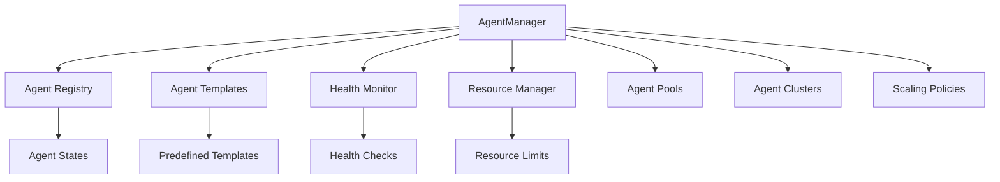

[根目录](../../CLAUDE.md) > [src](../) > **agents**

# 代理系统模块 (src/agents/)

## 模块职责

代理系统是 Claude Flow 的核心组件，负责管理 AI 代理的完整生命周期，包括创建、启动、监控、协调和销毁。该模块提供了企业级的代理管理能力，支持多种代理类型、自动扩缩容、健康监控和资源管理。

## 架构概览



## 主要组件

### 核心文件
- **agent-manager.ts** - 代理管理器主类，负责代理的完整生命周期管理
- **agent-registry.ts** - 代理注册表，跟踪所有活跃代理
- **agent-loader.ts** - 代理加载器，负责动态加载和启动代理

### 代理模板系统
模块预定义了多种专业代理类型：

- **researcher** - 研究代理，专注信息收集和分析
- **coder/developer** - 开发代理，专注代码生成和实现
- **tester** - 测试代理，专注质量保证和测试
- **reviewer** - 代码审查代理，专注代码质量检查
- **analyst** - 分析代理，专注数据分析和可视化
- **architect** - 架构师代理，专注系统设计和架构
- **task-planner** - 任务规划代理，专注任务分解和规划

### 高级特性

#### 代理池管理
```typescript
interface AgentPool {
  id: string;
  name: string;
  type: AgentType;
  minSize: number;
  maxSize: number;
  autoScale: boolean;
  scaleUpThreshold: number;
  scaleDownThreshold: number;
}
```

#### 健康监控系统
- **响应性监控** - 检查代理心跳和响应时间
- **性能监控** - 跟踪任务完成时间和质量
- **可靠性监控** - 监控成功率和错误率
- **资源监控** - 监控 CPU、内存、磁盘使用情况

#### 自动扩缩容
- 基于负载自动调整代理数量
- 支持多种扩缩容策略
- 可配置的扩缩容策略和冷却期

## 开发规范

### 代理模板定义
每个代理模板必须包含：
```typescript
interface AgentTemplate {
  name: string;
  type: AgentType;
  capabilities: AgentCapabilities;
  config: Partial<AgentConfig>;
  environment: Partial<AgentEnvironment>;
  startupScript?: string;
  dependencies?: string[];
}
```

### 代理状态管理
代理状态遵循严格的状态转换：
- `initializing` → `idle` → `busy` → `idle`
- `error` → `terminating` → `terminated`
- 支持自动重启和故障恢复

### 事件驱动架构
代理管理器基于事件驱动架构，主要事件：
- `agent:created` - 代理创建
- `agent:started` - 代理启动
- `agent:stopped` - 代理停止
- `agent:error` - 代理错误
- `agent:heartbeat-timeout` - 心跳超时

## 测试指南

### 单元测试
- 测试代理生命周期管理
- 测试健康监控系统
- 测试扩缩容逻辑
- 测试故障恢复机制

### 集成测试
- 测试多代理协作
- 测试代理池管理
- 测试资源限制执行
- 测试事件处理

### 性能测试
- 测试大量代理并发操作
- 测试内存泄漏防护
- 测试资源使用效率

## 与其他模块的集成

### 内存管理模块
- 代理状态持久化到分布式内存系统
- 代理配置和模板的集中存储
- 代理间通信的内存共享

### CLI 模块
- 通过 CLI 命令管理代理
- 代理状态的实时监控
- 代理配置的动态更新

### API 模块
- RESTful API 用于代理管理
- WebSocket 用于实时状态更新
- 代理指标的外部访问

### 协调模块
- 代理间的任务协调
- 资源分配和调度
- 冲突解决和优先级管理

## 配置和脚本

### 环境配置
```typescript
interface AgentManagerConfig {
  maxAgents: number;                    // 最大代理数量
  defaultTimeout: number;               // 默认超时时间
  heartbeatInterval: number;            // 心跳间隔
  healthCheckInterval: number;          // 健康检查间隔
  autoRestart: boolean;                 // 自动重启
  resourceLimits: ResourceLimits;       // 资源限制
  agentDefaults: AgentDefaults;         // 代理默认配置
  environmentDefaults: EnvironmentDefaults; // 环境默认配置
}
```

### 启动脚本
每个代理类型都有对应的启动脚本：
- `./scripts/start-researcher.ts`
- `./scripts/start-developer.ts`
- `./scripts/start-tester.ts`
- 等等...

### 权限管理
代理权限系统支持细粒度权限控制：
- `file-read` - 文件读取权限
- `file-write` - 文件写入权限
- `terminal-access` - 终端访问权限
- `git-access` - Git 操作权限
- `web-access` - 网络访问权限

## 常见问题 (FAQ)

### Q: 如何创建自定义代理类型？
A: 通过 AgentTemplate 定义新类型，并在 agent-manager.ts 中注册模板。

### Q: 代理资源限制如何配置？
A: 在 AgentManagerConfig 中设置 resourceLimits，支持 CPU、内存、磁盘限制。

### Q: 如何监控代理健康状态？
A: 通过 HealthMonitor 系统，自动检查响应性、性能、可靠性和资源使用。

### Q: 代理池如何实现自动扩缩容？
A: 基于池利用率和配置的阈值，自动调整代理数量。

## 相关文件清单

### 核心文件
- `agent-manager.ts` - 主要代理管理器
- `agent-registry.ts` - 代理注册表
- `agent-loader.ts` - 代理加载器

### 工具和配置
- 代理模板配置文件
- 启动脚本目录 `./scripts/`
- 权限配置文件

### 测试文件
- `__tests__/agent-manager.test.ts`
- `__tests__/agent-registry.test.ts`
- `__tests__/agent-lifecycle.test.ts`

## 变更记录 (Changelog)

### v2.7.0
- 添加了代理池自动扩缩容功能
- 改进了健康监控系统
- 增加了更多预定义代理模板

### v2.6.0
- 重构了代理状态管理
- 优化了资源监控
- 增强了故障恢复机制

### v2.5.0
- 初始版本，包含基本的代理管理功能
- 实现了代理生命周期管理
- 添加了基础的健康监控