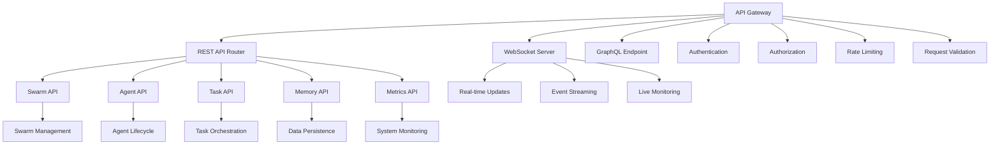

[根目录](../../CLAUDE.md) > [src](../) > **api**

# API 服务模块 (src/api/)

## 模块职责

API 服务模块是 Claude Flow 的对外接口层，提供了完整的 RESTful API、WebSocket 实时通信和 OpenAPI 规范支持。该模块负责处理外部系统的集成请求，提供代理管理、任务编排、系统监控和数据查询的标准化接口。

## 架构概览



## 主要组件

### 核心系统
- **swarm-api.ts** - 群体协调 API，提供群体管理、代理生成和任务编排接口
- **claude-client.ts** - Claude API 客户端，与 Anthropic Claude 服务集成
- **claude-client-v2.5.ts** - Claude API 客户端的增强版本
- **claude-client-enhanced.ts** - 增强版 Claude API 客户端

### 路由系统
- **routes/analysis.js** - 分析相关路由
- **database-service.ts** - 数据库服务
- **auth-service.ts** - 认证服务

### 错误处理
- **claude-api-errors.ts** - API 错误定义和处理

### 数据模式
- **database-schema.sql** - 数据库结构定义

## 核心功能

### Swarm API 接口
```typescript
// 群体管理
POST   /api/swarms                    // 创建新群体
GET    /api/swarms                    // 获取群体列表
GET    /api/swarms/:swarmId           // 获取群体详情
DELETE /api/swarms/:swarmId           // 删除群体
POST   /api/swarms/:swarmId/scale     // 扩缩容群体

// 代理管理
POST   /api/swarms/:swarmId/agents    // 在群体中生成代理
GET    /api/swarms/:swarmId/agents    // 获取群体代理列表
GET    /api/swarms/:swarmId/agents/:agentId  // 获取代理详情
DELETE /api/swarms/:swarmId/agents/:agentId  // 终止代理

// 任务编排
POST   /api/swarms/:swarmId/tasks     // 创建任务
GET    /api/swarms/:swarmId/tasks     // 获取任务列表
GET    /api/swarms/:swarmId/tasks/:taskId    // 获取任务详情
DELETE /api/swarms/:swarmId/tasks/:taskId    // 取消任务

// 监控和指标
GET    /api/swarms/:swarmId/metrics   // 获取群体指标
GET    /api/swarms/:swarmId/status    // 获取群体状态
```

### Claude API 集成
```typescript
interface ClaudeAPIClient {
  // 基础对话
  sendMessage(message: string, options?: ChatOptions): Promise<ChatResponse>;

  // 高级功能
  sendStreamMessage(message: string, options?: StreamOptions): AsyncIterable<ChatChunk>;
  sendToolMessage(tools: Tool[], message: string): Promise<ToolResponse>;

  // 批量操作
  batchSend(messages: BatchMessage[]): Promise<BatchResponse>;

  // 会话管理
  createSession(config?: SessionConfig): Promise<Session>;
  getSession(sessionId: string): Promise<Session>;
  deleteSession(sessionId: string): Promise<void>;
}
```

### WebSocket 实时通信
```typescript
interface WebSocketEvents {
  // 代理事件
  'agent:created': AgentCreatedEvent;
  'agent:started': AgentStartedEvent;
  'agent:stopped': AgentStoppedEvent;
  'agent:error': AgentErrorEvent;
  'agent:heartbeat': AgentHeartbeatEvent;

  // 任务事件
  'task:created': TaskCreatedEvent;
  'task:assigned': TaskAssignedEvent;
  'task:completed': TaskCompletedEvent;
  'task:failed': TaskFailedEvent;

  // 系统事件
  'system:health': SystemHealthEvent;
  'system:metrics': SystemMetricsEvent;
  'system:alert': SystemAlertEvent;
}
```

## API 规范

### 认证和授权
```typescript
// API Key 认证
Authorization: Bearer <api_key>

// JWT 认证
Authorization: JWT <token>

// 权限模型
interface Permission {
  resource: string;     // 资源类型 (swarm, agent, task, memory)
  action: string;       // 操作类型 (create, read, update, delete)
  scope: string;        // 作用域 (own, group, all)
}
```

### 请求/响应格式
```typescript
// 标准响应格式
interface APIResponse<T = any> {
  success: boolean;
  data?: T;
  error?: APIError;
  metadata?: {
    timestamp: string;
    requestId: string;
    version: string;
  };
}

// 错误响应格式
interface APIError {
  code: string;
  message: string;
  details?: any;
  stack?: string;  // 仅开发环境
}
```

### 分页和过滤
```typescript
// 分页参数
interface PaginationParams {
  page?: number;          // 页码 (从 1 开始)
  limit?: number;         // 每页数量 (默认 20，最大 100)
  sortBy?: string;        // 排序字段
  sortOrder?: 'asc' | 'desc';  // 排序方向
}

// 过滤参数
interface FilterParams {
  status?: string[];      // 状态过滤
  type?: string[];        // 类型过滤
  createdAfter?: string;  // 创建时间过滤
  createdBefore?: string;
  tags?: string[];        // 标签过滤
}

// 搜索参数
interface SearchParams {
  query?: string;         // 搜索关键词
  fields?: string[];      // 搜索字段
  fuzzy?: boolean;        // 模糊搜索
}
```

## 开发规范

### API 设计原则
1. **RESTful 设计** - 遵循 REST 架构原则
2. **版本控制** - 使用 URL 版本控制 (`/api/v1/`)
3. **幂等性** - GET、PUT、DELETE 操作保证幂等性
4. **状态码规范** - 正确使用 HTTP 状态码
5. **错误处理** - 统一的错误响应格式

### 安全规范
```typescript
// 输入验证
interface ValidationSchema {
  body: Joi.Schema;       // 请求体验证
  params: Joi.Schema;     // 路径参数验证
  query: Joi.Schema;      // 查询参数验证
}

// 速率限制
interface RateLimitConfig {
  windowMs: number;       // 时间窗口 (毫秒)
  maxRequests: number;    // 最大请求数
  message?: string;       // 限制消息
  skipSuccessfulRequests?: boolean;
}

// CORS 配置
interface CORSConfig {
  origins: string[];      // 允许的源
  methods: string[];      // 允许的方法
  headers: string[];      // 允许的头部
  credentials: boolean;   // 是否允许凭证
}
```

### 文档规范
- **OpenAPI 3.0** - 使用 OpenAPI 规范定义 API
- **自动生成** - 通过代码注释自动生成文档
- **示例代码** - 提供各种语言的客户端示例
- **交互式文档** - 支持 Swagger UI 交互式测试

## 测试指南

### 单元测试
- 测试 API 路由处理逻辑
- 测试请求验证和错误处理
- 测试业务逻辑封装
- 测试数据库操作

### 集成测试
- 测试完整的 API 请求流程
- 测试认证和授权机制
- 测试 WebSocket 连接和事件
- 测试第三方服务集成

### 性能测试
- 测试并发请求处理能力
- 测试大文件上传/下载
- 测试长连接稳定性
- 测试内存和 CPU 使用情况

### 安全测试
- 测试输入验证和注入防护
- 测试认证和授权机制
- 测试速率限制效果
- 测试 HTTPS 和加密传输

## 与其他模块的集成

### 代理系统模块
- 通过 API 管理代理生命周期
- 实时推送代理状态变化
- 提供代理配置和监控接口

### 内存管理模块
- 提供 CRUD 接口访问内存数据
- 支持复杂查询和搜索操作
- 实现数据导入导出功能

### CLI 模块
- CLI 命令通过 API 调用后端服务
- 支持本地和远程 API 端点
- 提供 API 测试和调试工具

### 协调模块
- 通过 API 触发协调操作
- 提供分布式锁服务接口
- 支持跨系统的任务编排

## 配置和脚本

### API 配置文件
```json
{
  "api": {
    "port": 3000,
    "host": "0.0.0.0",
    "cors": {
      "origins": ["http://localhost:3000"],
      "methods": ["GET", "POST", "PUT", "DELETE"],
      "headers": ["Content-Type", "Authorization"]
    },
    "rateLimit": {
      "windowMs": 900000,
      "maxRequests": 100
    },
    "authentication": {
      "enabled": true,
      "type": "jwt",
      "secret": "your-secret-key",
      "expiresIn": "24h"
    }
  },
  "claude": {
    "apiKey": "your-claude-api-key",
    "baseUrl": "https://api.anthropic.com",
    "timeout": 30000,
    "maxRetries": 3
  }
}
```

### 环境变量
```bash
API_PORT                 # API 服务端口
API_HOST                 # API 服务主机
CORS_ORIGINS            # CORS 允许的源
JWT_SECRET              # JWT 密钥
CLAUDE_API_KEY          # Claude API 密钥
DATABASE_URL            # 数据库连接 URL
REDIS_URL               # Redis 连接 URL
```

### 启动脚本
```bash
# 开发模式
npm run dev:api

# 生产模式
npm run start:api

# 测试模式
npm run test:api

# 文档生成
npm run docs:api
```

## 常见问题 (FAQ)

### Q: 如何添加新的 API 端点？
A: 在相应的路由文件中定义新的路由，并实现处理函数。

### Q: 如何实现 API 版本控制？
A: 在 URL 中添加版本前缀，如 `/api/v1/`、`/api/v2/`。

### Q: 如何处理大量并发请求？
A: 使用负载均衡、连接池和缓存机制来优化并发处理。

### Q: 如何保证 API 安全性？
A: 实施认证授权、输入验证、速率限制和 HTTPS 加密。

## 相关文件清单

### 核心 API
- `swarm-api.ts` - 群体协调 API
- `claude-client.ts` - Claude API 客户端
- `claude-client-enhanced.ts` - 增强版 Claude 客户端
- `claude-api-errors.ts` - API 错误处理

### 服务和路由
- `database-service.ts` - 数据库服务
- `auth-service.ts` - 认证服务
- `routes/analysis.js` - 分析路由

### 数据和配置
- `database-schema.sql` - 数据库模式
- 配置文件 (JSON/YAML)

### 测试文件
- `__tests__/api/` - API 测试目录
- `__tests__/integration/` - 集成测试

## 变更记录 (Changelog)

### v2.7.0
- 添加了增强版 Claude API 客户端
- 改进了错误处理机制
- 优化了 WebSocket 性能
- 增强了安全性配置

### v2.6.0
- 重构了 Swarm API 架构
- 添加了实时事件推送
- 改进了认证和授权系统

### v2.5.0
- 初始 API 框架
- 实现了基础 REST 接口
- 添加了 WebSocket 支持
- 集成了 Claude API