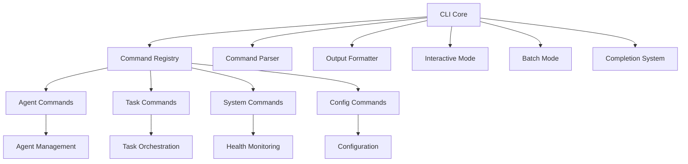

[根目录](../../CLAUDE.md) > [src](../) > **cli**

# 命令行界面模块 (src/cli/)

## 模块职责

CLI 模块是 Claude Flow 的用户交互界面，提供了完整的命令行工具集，支持代理管理、任务编排、系统监控和配置管理。该模块设计为用户友好的交互式界面，同时支持自动化脚本和批处理操作。

## 架构概览



## 主要组件

### 核心系统
- **cli-core.ts** - CLI 核心引擎，提供命令解析、执行和格式化功能
- **command-registry.js** - 命令注册表，管理所有可用命令
- **formatter.ts** - 输出格式化器，统一处理终端输出

### 命令分类

#### 代理管理命令 (`commands/agent.ts`)
```bash
claude-flow agent spawn researcher --name "AI研究员"
claude-flow agent list --status active
claude-flow agent stop agent_12345
claude-flow agent restart agent_12345
claude-flow agent stats agent_12345
```

#### 任务编排命令 (`commands/task.ts`)
```bash
claude-flow task create "开发新功能" --priority high
claude-flow task list --status pending
claude-flow task assign task_12345 agent_67890
claude-flow task cancel task_12345
```

#### 系统监控命令 (`commands/monitor.ts`)
```bash
claude-flow monitor status
claude-flow monitor health
claude-flow monitor metrics
claude-flow monitor logs --follow
```

#### 配置管理命令 (`commands/config.ts`)
```bash
claude-flow config init
claude-flow config set max_agents 50
claude-flow config get timeout
claude-flow config list
```

#### 群体智能命令 (`commands/hive-mind/`)
- `spawn.ts` - 生成智能群体
- `status.ts` - 查看群体状态
- `task.ts` - 群体任务管理
- `optimize-memory.ts` - 内存优化

#### SPARC 方法论命令 (`commands/sparc.ts`)
```bash
claude-flow sparc run spec-pseudocode "分析需求"
claude-flow sparc run architect "设计架构"
claude-flow sparc tdd "实现功能"
claude-flow sparc pipeline "完整开发流程"
```

#### Hook 系统命令 (`commands/hook.ts`)
```bash
claude-flow hook list
claude-flow hook create pre-task --script ./scripts/pre-task.js
claude-flow hook enable pre-task
claude-flow hook disable pre-task
```

### 高级功能

#### 交互式代理系统 (`agents/`)
- **base-agent.ts** - 代理基类
- **coder.ts** - 编程代理
- **researcher.ts** - 研究代理
- **tester.ts** - 测试代理
- **architect.ts** - 架构师代理
- **coordinator.ts** - 协调代理

#### 自动补全系统 (`completion.ts`)
- 智能命令补全
- 参数提示
- 上下文感知补全

#### 启动管理 (`commands/start/`)
- **process-manager.ts** - 进程管理器
- **system-monitor.ts** - 系统监控
- **process-ui.ts** - 进程用户界面

## 开发规范

### 命令定义模式
所有命令都遵循统一的定义模式：
```typescript
interface Command {
  name: string;
  description: string;
  aliases?: string[];
  options?: Option[];
  action: (ctx: CommandContext) => Promise<void>;
}

interface Option {
  name: string;
  short?: string;
  description: string;
  type: 'string' | 'boolean' | 'number';
  default?: unknown;
  required?: boolean;
}
```

### 输出格式规范
- **成功消息** - 绿色勾号 ✅
- **错误消息** - 红色叉号 ❌
- **警告消息** - 黄色感叹号 ⚠️
- **信息消息** - 蓝色信息 ℹ️

### 错误处理
- 统一的错误处理机制
- 用户友好的错误消息
- 详细的调试信息（--verbose 模式）

## 测试指南

### 单元测试
- 测试命令解析和执行
- 测试参数验证
- 测试错误处理
- 测试输出格式化

### 集成测试
- 测试命令与后端系统的集成
- 测试复杂的工作流
- 测试并发命令执行

### 用户接受测试
- 测试用户体验
- 测试命令发现和学习
- 测试帮助系统的有效性

## 与其他模块的集成

### 代理系统模块
- 通过 CLI 命令管理代理生命周期
- 实时显示代理状态和指标
- 支持代理配置的动态修改

### 内存管理模块
- 通过 CLI 查询内存使用情况
- 支持内存清理和优化操作
- 提供内存分析工具

### API 服务模块
- CLI 命令通过 API 调用后端服务
- 支持 API 配置和测试
- 提供 API 响应格式化

### 可执行文件模块
- CLI 作为主要入口点调用各种可执行文件
- 支持不同运行时的自动检测和切换

## 配置和脚本

### CLI 配置文件
```json
{
  "cli": {
    "defaultTimeout": 30000,
    "maxConcurrency": 10,
    "outputFormat": "pretty",
    "colorOutput": true,
    "autoComplete": true
  },
  "commands": {
    "agent": {
      "defaultType": "researcher",
      "autoRestart": true
    },
    "task": {
      "defaultPriority": "medium",
      "autoAssign": false
    }
  }
}
```

### 环境变量
```bash
CLAUDE_FLOW_CONFIG_PATH    # 配置文件路径
CLAUDE_FLOW_LOG_LEVEL      # 日志级别
CLAUDE_FLOW_API_ENDPOINT   # API 端点
CLAUDE_FLOW_TIMEOUT        # 默认超时时间
```

### 启动脚本
- `claude-flow` - 主启动脚本
- `claude-flow-dev` - 开发模式启动脚本
- `claude-flow-swarm` - 群体模式启动脚本

## 常见问题 (FAQ)

### Q: 如何添加新的 CLI 命令？
A: 在 `commands/` 目录下创建新的命令文件，并在 `command-registry.js` 中注册。

### Q: 如何实现命令的自动补全？
A: 使用 `completion.ts` 中的补全系统，添加新的补全规则。

### Q: 如何格式化命令输出？
A: 使用 `formatter.ts` 中的格式化函数，支持多种输出格式。

### Q: 如何处理长时间运行的命令？
A: 使用进度条、状态更新和取消机制来改善用户体验。

## 相关文件清单

### 核心文件
- `cli-core.ts` - CLI 核心引擎
- `command-registry.js` - 命令注册表
- `formatter.ts` - 输出格式化器
- `completion.ts` - 自动补全系统

### 命令目录
- `commands/agent.ts` - 代理管理命令
- `commands/task.ts` - 任务管理命令
- `commands/config.ts` - 配置管理命令
- `commands/monitor.ts` - 监控命令
- `commands/hive-mind/` - 群体智能命令
- `commands/sparc.ts` - SPARC 方法论命令
- `commands/hook.ts` - Hook 系统命令

### 代理系统
- `agents/base-agent.ts` - 代理基类
- `agents/coder.ts` - 编程代理
- `agents/researcher.ts` - 研究代理
- `agents/tester.ts` - 测试代理

### 测试文件
- `__tests__/command-registry.test.js`
- `__tests__/simple-cli.test.js`
- `__tests__/utils.test.js`

## 变更记录 (Changelog)

### v2.7.0
- 添加了群体智能命令集
- 改进了交互式模式
- 增强了自动补全系统
- 优化了错误处理和用户反馈

### v2.6.0
- 重构了命令注册系统
- 添加了 SPARC 方法论支持
- 改进了进程管理功能

### v2.5.0
- 初始 CLI 架构
- 实现了基本命令集
- 添加了配置管理系统