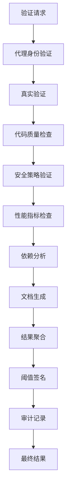

[根目录](../../CLAUDE.md) > [src](../) > **verification**

# 验证管道模块 (src/verification)

## 模块架构与职责

验证管道模块是 Claude-Flow 的质量保证和安全性核心，提供了企业级的代理行为验证、真实验证和安全性保障系统。该模块采用多层次验证架构，确保所有代理执行都经过严格的质量和安全检查。

### 验证系统架构

```
┌─────────────────────────────────────────────────────────────┐
│                   验证管道系统架构                             │
├─────────────────────────────────────────────────────────────┤
│  ┌─────────────────┐  ┌─────────────────┐  ┌─────────────────┐ │
│  │SecurityEnforce- │  │Verification-    │  │Verification-    │ │
│  │mentSystem       │  │Validator        │  │EvidenceCollect  │ │
│  │(安全强制系统)    │  │(验证器)         │  │(证据收集器)      │ │
│  └─────────────────┘  └─────────────────┘  └─────────────────┘ │
├─────────────────────────────────────────────────────────────┤
│  ┌─────────────────┐  ┌─────────────────┐  ┌─────────────────┐ │
│  │ CodeQuality     │  │SecurityPolicy   │  │AuditTrail       │ │
│  │ (代码质量)       │  │ (安全策略)       │  │ (审计跟踪)       │ │
│  └─────────────────┘  └─────────────────┘  └─────────────────┘ │
├─────────────────────────────────────────────────────────────┤
│  ┌─────────────────┐  ┌─────────────────┐  ┌─────────────────┐ │
│  │ Cryptographic   │  │ ByzantineFault  │  │ ZeroKnowledge   │ │
│  │ Core            │  │ Tolerance       │  │ Proof           │ │
│  │ (密码学核心)     │  │ (拜占庭容错)     │  │ (零知识证明)     │ │
│  └─────────────────┘  └─────────────────┘  └─────────────────┘ │
└─────────────────────────────────────────────────────────────┘
```

## 主要组件和接口

### 1. SecurityEnforcementSystem - 安全强制系统

**职责**: 提供全面的安全验证和强制执行机制，确保没有代理能够绕过验证过程。

**核心功能**:
- **代理认证**: 基于密码学的代理身份验证
- **真实验证**: 所有真实验证请求的强制执行
- **拜占庭容错**: 防止恶意代理的协同攻击
- **零知识证明**: 验证信息而不泄露敏感数据
- **审计跟踪**: 完整的验证过程审计记录
- **阈值签名**: 分布式共识的密码学保证

**安全架构层次**:
```
┌─────────────────────────────────────────────────────────────┐
│                    7层安全架构                                │
├─────────────────────────────────────────────────────────────┤
│ 7. 阈值签名验证 (Threshold Signature Verification)            │
│ 6. 拜占庭容错共识 (Byzantine Fault Tolerance Consensus)       │
│ 5. 零知识证明系统 (Zero-Knowledge Proof System)               │
│ 4. 审计跟踪完整性 (Audit Trail Integrity)                     │
│ 3. 高级限流保护 (Advanced Rate Limiting)                      │
│ 2. 代理身份认证 (Agent Identity Authentication)               │
│ 1. 密码学基础 (Cryptographic Foundation)                      │
└─────────────────────────────────────────────────────────────┘
```

**关键接口**:
```typescript
interface SecurityEnforcementSystem {
  // 系统管理
  initialize(participants: string[]): Promise<void>;
  emergencyShutdown(reason: string): Promise<void>;

  // 代理管理
  registerAgent(agentId: string, capabilities: string[], securityLevel: SecurityLevel): Promise<AgentIdentity>;
  revokeAgent(agentId: string, reason: string): Promise<void>;

  // 验证处理
  processVerificationRequest(request: VerificationRequest): Promise<VerificationResult>;

  // 状态查询
  getSecurityStatus(): SecurityStatus;
  exportSecurityReport(): SecurityReport;
}
```

**使用示例**:
```typescript
// 初始化安全系统
const securitySystem = new SecurityEnforcementSystem(totalNodes: 5, threshold: 3);

await securitySystem.initialize([
  'agent-1', 'agent-2', 'agent-3', 'agent-4', 'agent-5'
]);

// 注册代理
const agentIdentity = await securitySystem.registerAgent(
  'senior-developer',
  ['code_generation', 'code_review', 'testing'],
  'HIGH'
);

// 处理验证请求
const verificationResult = await securitySystem.processVerificationRequest({
  requestId: generateId(),
  agentId: 'senior-developer',
  truthClaim: 'This code implements secure authentication',
  timestamp: new Date(),
  nonce: generateNonce(),
  signature: agentSignature
});

console.log('验证结果:', {
  verified: verificationResult.verified,
  confidence: verificationResult.confidence,
  evidence: verificationResult.evidence
});
```

### 2. VerificationPipeline - 验证管道

**职责**: 提供完整的验证流程，包括代码质量、安全策略、性能指标等多维度验证。

**验证流程**:


**验证阶段**:
```typescript
interface VerificationStage {
  name: string;
  description: string;
  priority: number;
  enabled: boolean;
  validator: StageValidator;
  required: boolean;
}

// 验证管道配置
const verificationStages: VerificationStage[] = [
  {
    name: 'authentication',
    description: '验证代理身份和权限',
    priority: 100,
    enabled: true,
    validator: authenticationValidator,
    required: true
  },
  {
    name: 'code_quality',
    description: '代码质量和规范检查',
    priority: 90,
    enabled: true,
    validator: codeQualityValidator,
    required: true
  },
  {
    name: 'security_scan',
    description: '安全漏洞扫描',
    priority: 95,
    enabled: true,
    validator: securityValidator,
    required: true
  },
  {
    name: 'performance_check',
    description: '性能指标验证',
    priority: 70,
    enabled: true,
    validator: performanceValidator,
    required: false
  },
  {
    name: 'dependency_analysis',
    description: '依赖关系和安全检查',
    priority: 80,
    enabled: true,
    validator: dependencyValidator,
    required: true
  }
];
```

### 3. SecurityPolicy - 安全策略引擎

**职责**: 定义和执行全面的安全策略，包括访问控制、数据保护和合规性要求。

**策略类型**:
```typescript
// 安全策略接口
interface SecurityPolicy {
  id: string;
  name: string;
  description: string;
  category: PolicyCategory;
  rules: SecurityRule[];
  enforcement: EnforcementLevel;
  severity: SeverityLevel;
}

// 策略规则
interface SecurityRule {
  id: string;
  condition: RuleCondition;
  action: RuleAction;
  parameters: Record<string, any>;
}

// 内置安全策略
const securityPolicies: SecurityPolicy[] = [
  // 代码注入防护
  {
    id: 'code_injection_prevention',
    name: '代码注入防护策略',
    description: '防止恶意代码注入攻击',
    category: 'SECURITY',
    rules: [
      {
        id: 'no_eval_usage',
        condition: {
          type: 'pattern_match',
          patterns: ['eval\\(', 'Function\\(', 'setTimeout\\(.*string']
        },
        action: {
          type: 'block',
          message: '禁止使用 eval 或动态代码执行'
        }
      }
    ],
    enforcement: 'BLOCK',
    severity: 'HIGH'
  },

  // 数据泄露防护
  {
    id: 'data_leakage_prevention',
    name: '数据泄露防护策略',
    description: '防止敏感数据泄露',
    category: 'DATA_PROTECTION',
    rules: [
      {
        id: 'no_hardcoded_secrets',
        condition: {
          type: 'entropy_check',
          patterns: ['password', 'secret', 'key', 'token'],
          minEntropy: 3.5
        },
        action: {
          type: 'alert',
          message: '检测到可能硬编码的敏感信息'
        }
      }
    ],
    enforcement: 'ALERT',
    severity: 'MEDIUM'
  }
];
```

### 4. CodeQuality - 代码质量检查器

**职责**: 全面的代码质量评估，包括代码规范、复杂度、可维护性和最佳实践检查。

**质量指标**:
```typescript
interface QualityMetrics {
  // 基础指标
  linesOfCode: number;
  cyclomaticComplexity: number;
  maintainabilityIndex: number;
  technicalDebt: number;

  // 代码规范
  codeStyle: StyleCompliance;
  namingConventions: NamingCompliance;
  documentation: DocumentationScore;

  // 架构质量
  coupling: CouplingMetrics;
  cohesion: CohesionScore;
  designPatterns: PatternUsage;

  // 测试覆盖
  testCoverage: CoverageMetrics;
  testQuality: TestQualityScore;
}

// 代码质量检查器
class CodeQualityChecker {
  async analyzeCode(sourceCode: string, language: string): Promise<QualityReport> {
    const metrics = await Promise.all([
      this.calculateComplexity(sourceCode, language),
      this.checkStyleCompliance(sourceCode, language),
      this.analyzeDependencies(sourceCode),
      this.checkTestCoverage(sourceCode),
      this.evaluateDocumentation(sourceCode)
    ]);

    return this.generateQualityReport(metrics);
  }

  private async calculateComplexity(code: string, language: string): Promise<ComplexityMetrics> {
    // 圈复杂度计算
    const cyclomaticComplexity = this.calculateCyclomaticComplexity(code, language);

    // 认知复杂度计算
    const cognitiveComplexity = this.calculateCognitiveComplexity(code, language);

    // 嵌套深度分析
    const nestingDepth = this.analyzeNestingDepth(code, language);

    return {
      cyclomatic: cyclomaticComplexity,
      cognitive: cognitiveComplexity,
      nesting: nestingDepth
    };
  }
}
```

### 5. AuditTrail - 审计跟踪系统

**职责**: 提供完整的审计记录，确保所有验证过程可追溯、可验证和不可篡改。

**审计功能**:
```typescript
interface AuditEntry {
  eventId: string;
  timestamp: Date;
  agentId: string;
  action: string;
  details: any;
  cryptographicProof: string;
  witnessSignatures: string[];
  severity: AuditSeverity;
  category: AuditCategory;
}

// 审计跟踪系统
class AuditTrailSystem {
  async createAuditEntry(
    agentId: string,
    action: string,
    details: any,
    witnesses: string[] = []
  ): Promise<AuditEntry> {
    const eventId = this.generateEventId();
    const timestamp = new Date();

    // 创建密码学证明
    const cryptographicProof = this.createCryptographicProof({
      eventId,
      timestamp,
      agentId,
      action,
      details
    });

    // 收集见证签名
    const witnessSignatures = await this.collectWitnessSignatures(
      cryptographicProof,
      witnesses
    );

    const auditEntry: AuditEntry = {
      eventId,
      timestamp,
      agentId,
      action,
      details,
      cryptographicProof,
      witnessSignatures,
      severity: this.determineSeverity(action, details),
      category: this.categorizeAction(action)
    };

    await this.persistAuditEntry(auditEntry);
    return auditEntry;
  }

  // 验证审计跟踪完整性
  async verifyAuditTrail(): Promise<VerificationResult> {
    const entries = await this.getAllAuditEntries();
    const results = await Promise.all(
      entries.map(entry => this.verifyAuditEntry(entry))
    );

    return {
      valid: results.every(r => r.valid),
      corruptedEntries: results.filter(r => !r.valid).map(r => r.entryId),
      verificationTime: new Date()
    };
  }
}
```

## 开发规范和最佳实践

### 1. 验证器开发规范

```typescript
// 标准验证器接口
interface IValidator {
  name: string;
  version: string;
  description: string;
  category: ValidatorCategory;

  // 验证方法
  validate(
    claim: VerificationClaim,
    context: ValidationContext
  ): Promise<ValidationResult>;

  // 配置方法
  configure(config: ValidatorConfig): Promise<void>;

  // 健康检查
  healthCheck(): Promise<HealthStatus>;
}

// 基础验证器实现
abstract class BaseValidator implements IValidator {
  abstract name: string;
  abstract version: string;
  abstract description: string;
  abstract category: ValidatorCategory;

  protected config: ValidatorConfig;
  protected metrics: ValidatorMetrics;

  async validate(
    claim: VerificationClaim,
    context: ValidationContext
  ): Promise<ValidationResult> {
    const startTime = Date.now();

    try {
      // 1. 输入验证
      await this.validateInput(claim, context);

      // 2. 权限检查
      await this.checkPermissions(context);

      // 3. 执行验证逻辑
      const result = await this.performValidation(claim, context);

      // 4. 更新指标
      this.updateMetrics(Date.now() - startTime, result.passed);

      return result;
    } catch (error) {
      this.updateMetrics(Date.now() - startTime, false);
      throw error;
    }
  }

  protected abstract performValidation(
    claim: VerificationClaim,
    context: ValidationContext
  ): Promise<ValidationResult>;

  protected async validateInput(claim: VerificationClaim, context: ValidationContext): Promise<void> {
    if (!claim.agentId || !claim.truthClaim) {
      throw new ValidationError('Invalid claim: missing required fields');
    }

    if (!context.agentIdentity) {
      throw new ValidationError('Invalid context: missing agent identity');
    }
  }

  protected async checkPermissions(context: ValidationContext): Promise<void> {
    const requiredPermissions = this.getRequiredPermissions();
    const agentPermissions = context.agentIdentity.capabilities;

    const hasPermission = requiredPermissions.every(permission =>
      agentPermissions.includes(permission)
    );

    if (!hasPermission) {
      throw new AuthorizationError('Insufficient permissions for validation');
    }
  }
}
```

### 2. 安全策略开发模式

```typescript
// 安全策略接口
interface ISecurityPolicy {
  id: string;
  name: string;
  category: PolicyCategory;

  // 策略评估
  evaluate(context: EvaluationContext): Promise<PolicyEvaluationResult>;

  // 策略执行
  enforce(result: PolicyEvaluationResult): Promise<void>;

  // 策略配置
  configure(config: PolicyConfig): Promise<void>;
}

// 策略引擎
class SecurityPolicyEngine {
  private policies = new Map<string, ISecurityPolicy>();
  private executionOrder: string[];

  async addPolicy(policy: ISecurityPolicy): Promise<void> {
    // 验证策略配置
    await this.validatePolicy(policy);

    // 检查策略冲突
    await this.checkPolicyConflicts(policy);

    // 注册策略
    this.policies.set(policy.id, policy);
    this.updateExecutionOrder();
  }

  async evaluateAll(context: EvaluationContext): Promise<PolicyReport> {
    const results: PolicyEvaluationResult[] = [];

    for (const policyId of this.executionOrder) {
      const policy = this.policies.get(policyId);
      if (!policy) continue;

      try {
        const result = await policy.evaluate(context);
        results.push(result);

        // 如果是阻止策略且违反了，停止后续评估
        if (result.action === 'BLOCK' && result.violated) {
          break;
        }
      } catch (error) {
        results.push({
          policyId,
          violated: true,
          action: 'BLOCK',
          reason: `策略评估失败: ${error.message}`,
          severity: 'HIGH'
        });
        break;
      }
    }

    return this.generatePolicyReport(results);
  }
}
```

### 3. 证据收集模式

```typescript
// 证据收集器
interface IEvidenceCollector {
  collect(
    claim: VerificationClaim,
    context: ValidationContext
  ): Promise<EvidenceCollection>;

  getType(): EvidenceType;
  getReliability(): number;
}

// 多证据聚合器
class EvidenceAggregator {
  private collectors = new Map<EvidenceType, IEvidenceCollector>();

  async collectEvidence(
    claim: VerificationClaim,
    context: ValidationContext
  ): Promise<EvidenceReport> {
    const evidencePromises = Array.from(this.collectors.values()).map(
      collector => this.collectWithRetry(collector, claim, context)
    );

    const collections = await Promise.allSettled(evidencePromises);
    const validCollections = collections
      .filter((result): result is PromiseFulfilledResult<EvidenceCollection> =>
        result.status === 'fulfilled'
      )
      .map(result => result.value);

    return this.aggregateEvidence(validCollections);
  }

  private async collectWithRetry(
    collector: IEvidenceCollector,
    claim: VerificationClaim,
    context: ValidationContext
  ): Promise<EvidenceCollection> {
    const maxRetries = 3;
    let lastError: Error;

    for (let attempt = 1; attempt <= maxRetries; attempt++) {
      try {
        return await collector.collect(claim, context);
      } catch (error) {
        lastError = error;
        if (attempt < maxRetries) {
          await this.delay(Math.pow(2, attempt) * 1000);
        }
      }
    }

    throw lastError;
  }

  private aggregateEvidence(collections: EvidenceCollection[]): EvidenceReport {
    // 计算权重
    const totalWeight = collections.reduce(
      (sum, collection) => sum + this.calculateWeight(collection),
      0
    );

    // 聚合证据
    const aggregatedEvidence = collections.map(collection => ({
      type: collection.type,
      data: collection.evidence,
      reliability: collection.reliability,
      weight: this.calculateWeight(collection) / totalWeight,
      timestamp: collection.timestamp
    }));

    return {
      evidence: aggregatedEvidence,
      confidence: this.calculateConfidence(aggregatedEvidence),
      completeness: this.calculateCompleteness(collections),
      reliability: this.calculateReliability(aggregatedEvidence)
    };
  }
}
```

### 4. 性能优化模式

```typescript
// 验证结果缓存
class VerificationCache {
  private cache = new LRUCache<string, CachedVerificationResult>(1000);

  async getCachedResult(
    claimHash: string,
    contextHash: string
  ): Promise<CachedVerificationResult | null> {
    const cacheKey = `${claimHash}:${contextHash}`;
    const cached = this.cache.get(cacheKey);

    if (!cached || this.isExpired(cached)) {
      return null;
    }

    return cached;
  }

  async cacheResult(
    claimHash: string,
    contextHash: string,
    result: ValidationResult
  ): Promise<void> {
    const cacheKey = `${claimHash}:${contextHash}`;

    const cachedResult: CachedVerificationResult = {
      result,
      timestamp: Date.now(),
      ttl: this.calculateTTL(result),
      dependencies: this.extractDependencies(result)
    };

    this.cache.set(cacheKey, cachedResult);
  }

  private calculateTTL(result: ValidationResult): number {
    // 基于验证结果类型计算缓存时间
    switch (result.type) {
      case 'code_quality':
        return 5 * 60 * 1000; // 5分钟
      case 'security_scan':
        return 15 * 60 * 1000; // 15分钟
      case 'performance_check':
        return 30 * 60 * 1000; // 30分钟
      default:
        return 10 * 60 * 1000; // 10分钟
    }
  }
}
```

## 与其他模块的集成

### 1. 与 Core 模块集成

```typescript
// 核心系统验证集成
class VerificationCoreIntegration {
  async setupCoreVerification(): Promise<void> {
    // 验证代理创建
    this.orchestrator.on('agent:created', async (event) => {
      const { agent } = event.data;

      // 注册代理到验证系统
      await this.securitySystem.registerAgent(
        agent.id,
        agent.capabilities,
        this.determineSecurityLevel(agent.type)
      );
    });

    // 验证任务执行
    this.orchestrator.on('task:completed', async (event) => {
      const { task, result } = event.data;

      // 验证任务执行结果
      const verification = await this.verificationPipeline.verifyTaskResult(
        task,
        result
      );

      if (!verification.passed) {
        await this.orchestrator.markTaskAsFailed(task.id, verification.reason);
      }
    });

    // 安全事件处理
    this.eventBus.on('security:violation', async (event) => {
      const { violation } = event.data;

      // 记录安全违规
      await this.auditTrail.createAuditEntry(
        violation.agentId,
        'SECURITY_VIOLATION',
        violation
      );

      // 执行安全响应
      await this.handleSecurityViolation(violation);
    });
  }
}
```

### 2. 与 Swarm 模块集成

```typescript
// Swarm 验证集成
class VerificationSwarmIntegration {
  async setupSwarmVerification(): Promise<void> {
    // 代理注册验证
    this.swarmCoordinator.on('agent:registered', async (event) => {
      const { agentId, capabilities } = event.data;

      // 验证代理能力
      const capabilitiesVerification = await this.verificationSystem.validateCapabilities(
        agentId,
        capabilities
      );

      if (!capabilitiesVerification.valid) {
        await this.swarmCoordinator.unregisterAgent(agentId);
      }
    });

    // 任务分配验证
    this.swarmCoordinator.on('task:assigned', async (event) => {
      const { taskId, agentId } = event.data;

      // 验证任务分配的安全性
      const assignmentVerification = await this.verificationSystem.validateTaskAssignment(
        taskId,
        agentId
      );

      if (!assignmentVerification.safe) {
        await this.swarmCoordinator.revokeTask(taskId);
      }
    });

    // 执行过程监控
    this.swarmCoordinator.on('agent:heartbeat', async (event) => {
      const { agentId, metrics } = event.data;

      // 检测异常行为
      const anomaly = await this.securitySystem.detectAnomaly(agentId, metrics);

      if (anomaly.detected) {
        await this.handleAnomalousAgent(agentId, anomaly);
      }
    });
  }
}
```

### 3. 与 MCP 模块集成

```typescript
// MCP 验证工具集成
class VerificationMCPIntegration {
  registerVerificationTools(mcpServer: MCPServer): void {
    // 真实验证工具
    mcpServer.registerTool({
      name: 'verification_submit_claim',
      description: 'Submit truth claim for verification',
      inputSchema: {
        type: 'object',
        properties: {
          agentId: { type: 'string' },
          claim: { type: 'any' },
          evidence: { type: 'array' },
          priority: { enum: ['LOW', 'MEDIUM', 'HIGH', 'CRITICAL'] }
        },
        required: ['agentId', 'claim']
      },
      handler: async (args, context) => {
        const verificationRequest: VerificationRequest = {
          requestId: generateId(),
          agentId: args.agentId,
          truthClaim: args.claim,
          evidence: args.evidence || [],
          timestamp: new Date(),
          nonce: generateNonce(),
          priority: args.priority || 'MEDIUM'
        };

        return await this.securitySystem.processVerificationRequest(verificationRequest);
      }
    });

    // 安全状态查询工具
    mcpServer.registerTool({
      name: 'verification_security_status',
      description: 'Get comprehensive security status',
      inputSchema: {
        type: 'object',
        properties: {}
      },
      handler: async (args, context) => {
        return this.securitySystem.getSecurityStatus();
      }
    });

    // 审计跟踪查询工具
    mcpServer.registerTool({
      name: 'verification_audit_query',
      description: 'Query audit trail for specific events',
      inputSchema: {
        type: 'object',
        properties: {
          agentId: { type: 'string' },
          action: { type: 'string' },
          dateFrom: { type: 'string', format: 'date-time' },
          dateTo: { type: 'string', format: 'date-time' },
          limit: { type: 'number' }
        }
      },
      handler: async (args, context) => {
        return await this.auditTrail.searchAuditTrail({
          agentId: args.agentId,
          action: args.action,
          dateFrom: args.dateFrom ? new Date(args.dateFrom) : undefined,
          dateTo: args.dateTo ? new Date(args.dateTo) : undefined
        });
      }
    });
  }
}
```

### 4. 与 Coordination 模块集成

```typescript
// 协调验证集成
class VerificationCoordinationIntegration {
  async setupCoordinationVerification(): Promise<void> {
    // 任务验证集成
    this.coordinationManager.on('task:created', async (event) => {
      const { task } = event.data;

      // 验证任务安全性
      const taskVerification = await this.verificationSystem.validateTaskSecurity(
        task
      );

      if (!taskVerification.safe) {
        await this.coordinationManager.rejectTask(task.id, taskVerification.reason);
      }
    });

    // 资源访问验证
    this.coordinationManager.on('resource:request', async (event) => {
      const { resourceId, agentId } = event.data;

      // 验证资源访问权限
      const accessVerification = await this.securitySystem.verifyResourceAccess(
        agentId,
        resourceId
      );

      if (!accessVerification.authorized) {
        await this.coordinationManager.denyResourceAccess(resourceId, agentId);
      }
    });

    // 消息传递验证
    this.coordinationManager.on('message:sent', async (event) => {
      const { from, to, message } = event.data;

      // 验证消息安全性
      const messageVerification = await this.securitySystem.verifyMessage(
        from,
        to,
        message
      );

      if (!messageVerification.safe) {
        await this.coordinationManager.blockMessage(from, to);
      }
    });
  }
}
```

## 配置和使用示例

### 1. 基础验证系统配置

```json
{
  "verification": {
    "security": {
      "totalNodes": 5,
      "threshold": 3,
      "authentication": {
        "enabled": true,
        "requireSignature": true,
        "tokenExpiry": 3600000
      },
      "byzantine": {
        "enabled": true,
        "consensusThreshold": 0.67,
        "suspicionThreshold": 50
      }
    },
    "pipeline": {
      "stages": [
        {
          "name": "authentication",
          "enabled": true,
          "required": true,
          "timeout": 5000
        },
        {
          "name": "code_quality",
          "enabled": true,
          "required": true,
          "timeout": 15000
        },
        {
          "name": "security_scan",
          "enabled": true,
          "required": true,
          "timeout": 30000
        },
        {
          "name": "performance_check",
          "enabled": false,
          "required": false,
          "timeout": 10000
        }
      ]
    },
    "audit": {
      "enabled": true,
      "retentionDays": 90,
      "encryptionEnabled": true,
      "compressionEnabled": true
    },
    "performance": {
      "cacheEnabled": true,
      "maxConcurrentVerifications": 10,
      "verificationTimeout": 60000
    }
  }
}
```

### 2. 初始化验证系统

```typescript
import {
  SecurityEnforcementSystem,
  VerificationPipeline,
  SecurityPolicyEngine
} from './verification/index.js';

async function initializeVerificationSystem(): Promise<void> {
  // 1. 初始化安全强制系统
  const securitySystem = new SecurityEnforcementSystem(
    config.verification.security.totalNodes,
    config.verification.security.threshold
  );

  await securitySystem.initialize([
    'agent-1', 'agent-2', 'agent-3', 'agent-4', 'agent-5'
  });

  // 2. 初始化验证管道
  const verificationPipeline = new VerificationPipeline(
    config.verification.pipeline,
    securitySystem,
    auditTrail
  );

  await verificationPipeline.initialize();

  // 3. 初始化安全策略引擎
  const policyEngine = new SecurityPolicyEngine();

  // 注册内置安全策略
  await policyEngine.addPolicy(new CodeInjectionPreventionPolicy());
  await policyEngine.addPolicy(new DataLeakagePreventionPolicy());
  await policyEngine.addPolicy(new AccessControlPolicy());

  // 4. 设置事件监听
  setupVerificationEventListeners(securitySystem, verificationPipeline, policyEngine);

  console.log('✅ 验证系统初始化完成');
}
```

### 3. 创建自定义验证器

```typescript
// 自定义代码验证器
class CustomCodeValidator extends BaseValidator {
  name = 'custom_code_validator';
  version = '1.0.0';
  description = '自定义代码验证器';
  category = 'CODE_QUALITY';

  protected async performValidation(
    claim: VerificationClaim,
    context: ValidationContext
  ): Promise<ValidationResult> {
    const { code, language } = claim.truthClaim;

    // 1. 代码结构分析
    const structureAnalysis = await this.analyzeCodeStructure(code, language);

    // 2. 性能影响评估
    const performanceImpact = await this.assessPerformanceImpact(code, language);

    // 3. 安全风险评估
    const securityRisk = await this.assessSecurityRisk(code, language);

    const score = this.calculateValidationScore(
      structureAnalysis,
      performanceImpact,
      securityRisk
    );

    const passed = score >= 0.8;
    const warnings = this.generateWarnings(structureAnalysis, performanceImpact, securityRisk);

    return {
      passed,
      score,
      confidence: 0.95,
      details: {
        structure: structureAnalysis,
        performance: performanceImpact,
        security: securityRisk
      },
      warnings,
      recommendations: this.generateRecommendations(warnings),
      executionTime: Date.now() - context.startTime
    };
  }

  private async analyzeCodeStructure(code: string, language: string): Promise<StructureAnalysis> {
    // 实现代码结构分析逻辑
    return {
      complexity: this.calculateComplexity(code),
      maintainability: this.assessMaintainability(code),
      testability: this.assessTestability(code),
      documentation: this.assessDocumentation(code)
    };
  }

  private async assessPerformanceImpact(code: string, language: string): Promise<PerformanceImpact> {
    // 实现性能影响评估逻辑
    return {
      timeComplexity: this.analyzeTimeComplexity(code),
      spaceComplexity: this.analyzeSpaceComplexity(code),
      bottlenecks: this.identifyBottlenecks(code),
      optimizations: this.suggestOptimizations(code)
    };
  }

  private async assessSecurityRisk(code: string, language: string): Promise<SecurityRisk> {
    // 实现安全风险评估逻辑
    const vulnerabilities = await this.scanForVulnerabilities(code, language);

    return {
      vulnerabilities,
      riskScore: this.calculateRiskScore(vulnerabilities),
      mitigations: this.suggestMitigations(vulnerabilities)
    };
  }
}

// 注册自定义验证器
const customValidator = new CustomCodeValidator();
await verificationPipeline.addValidator(customValidator);
```

### 4. 高级安全策略配置

```typescript
// 自定义安全策略
class CustomSecurityPolicy implements ISecurityPolicy {
  id = 'custom_sensitive_data_protection';
  name = '敏感数据保护策略';
  category = 'DATA_PROTECTION';

  async evaluate(context: EvaluationContext): Promise<PolicyEvaluationResult> {
    const { code, agentId } = context;

    // 扫描敏感数据模式
    const sensitivePatterns = [
      /password\s*[:=]\s*['"]([^'"]+)['"]/gi,
      /api[_-]?key\s*[:=]\s*['"]([^'"]+)['"]/gi,
      /secret\s*[:=]\s*['"]([^'"]+)['"]/gi,
      /token\s*[:=]\s*['"]([^'"]{20,})['"]/gi
    ];

    const violations: string[] = [];

    for (const pattern of sensitivePatterns) {
      const matches = code.match(pattern);
      if (matches) {
        violations.push(`检测到可能的敏感数据: ${matches.join(', ')}`);
      }
    }

    // 检查加密使用情况
    const encryptionUsage = this.checkEncryptionUsage(code);
    if (!encryptionUsage.used && violations.length > 0) {
      violations.push('敏感数据未进行加密处理');
    }

    return {
      policyId: this.id,
      violated: violations.length > 0,
      action: violations.length > 0 ? 'BLOCK' : 'ALLOW',
      reason: violations.join('; '),
      severity: violations.length > 2 ? 'HIGH' : 'MEDIUM',
      recommendations: violations.length > 0 ? [
        '移除硬编码的敏感信息',
        '使用环境变量或密钥管理系统',
        '实施数据加密措施'
      ] : []
    };
  }

  async enforce(result: PolicyEvaluationResult): Promise<void> {
    if (result.action === 'BLOCK') {
      // 记录安全违规
      await this.auditTrail.createAuditEntry(
        result.agentId || 'unknown',
        'SECURITY_POLICY_VIOLATION',
        {
          policyId: result.policyId,
          violations: result.reason,
          severity: result.severity
        }
      );

      // 触发安全告警
      await this.triggerSecurityAlert(result);
    }
  }

  private checkEncryptionUsage(code: string): { used: boolean; methods: string[] } {
    const encryptionMethods = ['crypto', 'bcrypt', 'jsonwebtoken', 'crypto-js'];
    const used = encryptionMethods.some(method => code.includes(method));

    return {
      used,
      methods: encryptionMethods.filter(method => code.includes(method))
    };
  }
}

// 注册自定义策略
await policyEngine.addPolicy(new CustomSecurityPolicy());
```

## 性能优化建议

### 1. 并行验证优化

```typescript
// 并行验证执行器
class ParallelVerificationExecutor {
  async executeParallel(
    validators: IValidator[],
    claim: VerificationClaim,
    context: ValidationContext
  ): Promise<ValidationResult[]> {
    const maxConcurrency = config.verification.performance.maxConcurrentVerifications;

    // 分批并行执行
    const batches = this.chunkArray(validators, maxConcurrency);
    const results: ValidationResult[] = [];

    for (const batch of batches) {
      const batchResults = await Promise.allSettled(
        batch.map(validator => this.executeValidator(validator, claim, context))
      );

      results.push(
        ...batchResults
          .filter((result): result is PromiseFulfilledResult<ValidationResult> =>
            result.status === 'fulfilled'
          )
          .map(result => result.value)
      );
    }

    return results;
  }

  private async executeValidator(
    validator: IValidator,
    claim: VerificationClaim,
    context: ValidationContext
  ): Promise<ValidationResult> {
    try {
      return await validator.validate(claim, context);
    } catch (error) {
      return {
        passed: false,
        score: 0,
        confidence: 0,
        details: { error: error.message },
        warnings: [],
        recommendations: [],
        executionTime: 0
      };
    }
  }
}
```

### 2. 缓存策略优化

```typescript
// 智能验证缓存
class SmartVerificationCache {
  private cache = new Map<string, CacheEntry>();
  private dependencyGraph = new Map<string, Set<string>>();

  async getOrCompute(
    claimHash: string,
    contextHash: string,
    computeFn: () => Promise<ValidationResult>
  ): Promise<ValidationResult> {
    const cacheKey = `${claimHash}:${contextHash}`;

    // 检查缓存
    const cached = this.cache.get(cacheKey);
    if (cached && !this.isExpired(cached)) {
      // 检查依赖是否过期
      if (!this.hasExpiredDependencies(cached)) {
        return cached.result;
      } else {
        // 依赖过期，清理缓存
        this.invalidateCache(cacheKey);
      }
    }

    // 计算新结果
    const result = await computeFn();

    // 缓存结果
    this.cache.set(cacheKey, {
      result,
      timestamp: Date.now(),
      ttl: this.calculateTTL(result),
      dependencies: this.extractDependencies(result)
    });

    return result;
  }

  private hasExpiredDependencies(entry: CacheEntry): boolean {
    for (const dependency of entry.dependencies) {
      const depEntry = this.cache.get(dependency);
      if (!depEntry || this.isExpired(depEntry)) {
        return true;
      }
    }
    return false;
  }

  private invalidateCache(cacheKey: string): void {
    // 递归失效依赖项
    const dependents = this.dependencyGraph.get(cacheKey);
    if (dependents) {
      for (const dependent of dependents) {
        this.invalidateCache(dependent);
      }
    }

    this.cache.delete(cacheKey);
  }
}
```

## 监控和诊断

### 1. 验证系统指标

```typescript
interface VerificationMetrics {
  // 系统健康
  systemHealth: {
    overallStatus: 'HEALTHY' | 'DEGRADED' | 'UNHEALTHY';
    componentStatus: Record<string, ComponentStatus>;
    lastHealthCheck: Date;
  };

  // 验证性能
  verificationPerformance: {
    averageVerificationTime: number;
    verificationsPerSecond: number;
    successRate: number;
    errorRate: number;
    cacheHitRate: number;
  };

  // 安全指标
  securityMetrics: {
    totalVerificationRequests: number;
    blockedRequests: number;
    securityViolations: number;
    byzantineAttacks: number;
    authenticationFailures: number;
  };

  // 审计指标
  auditMetrics: {
    totalAuditEntries: number;
    auditTrailSize: number;
    integrityChecksPassed: number;
    integrityChecksFailed: number;
  };
}
```

### 2. 实时监控系统

```typescript
class VerificationMonitoringSystem {
  async generateHealthReport(): Promise<HealthReport> {
    const now = Date.now();

    const systemHealth = await this.checkSystemHealth();
    const performanceMetrics = await this.collectPerformanceMetrics();
    const securityStatus = await this.getSecurityStatus();
    const auditStatus = await this.getAuditStatus();

    return {
      timestamp: new Date(now),
      status: this.determineOverallStatus(systemHealth, performanceMetrics, securityStatus),
      components: {
        security: systemHealth,
        performance: performanceMetrics,
        audit: auditStatus
      },
      alerts: await this.getActiveAlerts(),
      recommendations: await this.generateRecommendations()
    };
  }

  private async checkSystemHealth(): Promise<ComponentHealth> {
    const checks = await Promise.allSettled([
      this.securitySystem.healthCheck(),
      this.verificationPipeline.healthCheck(),
      this.auditTrail.verifyIntegrity(),
      this.policyEngine.healthCheck()
    ]);

    const results = checks.map((check, index) => {
      const componentName = ['securitySystem', 'verificationPipeline', 'auditTrail', 'policyEngine'][index];

      if (check.status === 'fulfilled') {
        return { [componentName]: check.value };
      } else {
        return { [componentName]: { healthy: false, error: check.reason } };
      }
    });

    return Object.assign({}, ...results);
  }
}
```

## 故障排除指南

### 1. 常见问题诊断

**验证超时**
```typescript
// 诊断验证超时问题
async function diagnoseVerificationTimeout(claimId: string): Promise<void> {
  console.log('诊断验证超时问题:', claimId);

  // 检查验证器状态
  const validators = await verificationPipeline.getValidators();
  for (const validator of validators) {
    const health = await validator.healthCheck();
    console.log(`验证器 ${validator.name}:`, health);

    if (!health.healthy) {
      console.error(`验证器 ${validator.name} 状态异常:`, health.error);
    }
  }

  // 检查缓存状态
  const cacheStats = verificationPipeline.getCacheStats();
  console.log('缓存统计:', cacheStats);

  // 检查并发限制
  const concurrencyMetrics = verificationPipeline.getConcurrencyMetrics();
  console.log('并发指标:', concurrencyMetrics);
}
```

**安全验证失败**
```typescript
// 诊断安全验证失败
async function diagnoseSecurityFailure(agentId: string): Promise<void> {
  console.log('诊断安全验证失败:', agentId);

  // 检查代理身份
  const agentIdentity = await securitySystem.getAgentIdentity(agentId);
  if (!agentIdentity) {
    console.error('代理未注册:', agentId);
    return;
  }

  console.log('代理身份:', {
    agentId: agentIdentity.agentId,
    capabilities: agentIdentity.capabilities,
    securityLevel: agentIdentity.securityLevel,
    reputation: agentIdentity.reputation,
    lastVerified: agentIdentity.lastVerified
  });

  // 检查最近的验证记录
  const recentVerifications = await auditTrail.searchAuditTrail({
    agentId,
    dateFrom: new Date(Date.now() - 24 * 60 * 60 * 1000), // 最近24小时
    action: 'VERIFICATION_COMPLETED'
  });

  console.log('最近验证记录:', recentVerifications);

  // 检查安全违规
  const securityViolations = await auditTrail.searchAuditTrail({
    agentId,
    action: 'SECURITY_VIOLATION'
  });

  console.log('安全违规记录:', securityViolations);
}
```

### 2. 性能调优

```typescript
// 性能优化配置
const performanceOptimizedConfig = {
  verification: {
    performance: {
      maxConcurrentVerifications: Math.min(os.cpus().length * 2, 20),
      verificationTimeout: 30000,
      cacheEnabled: true,
      cacheMaxSize: 2000,
      cacheTTL: 600000, // 10分钟
      parallelExecution: true,
      lazyLoading: true
    },
    security: {
      authentication: {
        tokenCacheEnabled: true,
        tokenCacheSize: 1000
      },
      byzantine: {
        consensusTimeout: 5000,
        maxRetries: 3
      }
    }
  }
};
```

## 变更记录 (Changelog)

### v2.0.0 (2025-11-24)
- ✨ 全新: 企业级SecurityEnforcementSystem安全强制系统
- ✨ 新增: 7层安全架构验证
- ✨ 新增: 拜占庭容错和零知识证明支持
- ✨ 新增: 阈值签名分布式共识
- ✨ 新增: 完整的审计跟踪系统
- 🔧 改进: 验证管道性能优化
- 🔧 改进: 证据收集和聚合机制
- 🐛 修复: 并发安全问题

### v1.5.0 (2025-10-20)
- ✨ 新增: 安全策略引擎
- ✨ 新增: 代码质量检查器
- ✨ 新增: 依赖分析工具
- 🔧 改进: 验证结果缓存
- 📚 文档: 完善安全文档

---

> 验证管道模块是 Claude-Flow 的安全和质量保障核心，提供了企业级的验证和审计能力。通过多层安全架构、密码学保障和全面的审计跟踪，确保所有代理行为都经过严格验证，防止恶意攻击和质量问题。在开发自定义验证器时，请遵循安全最佳实践，确保验证逻辑的准确性和性能优化。